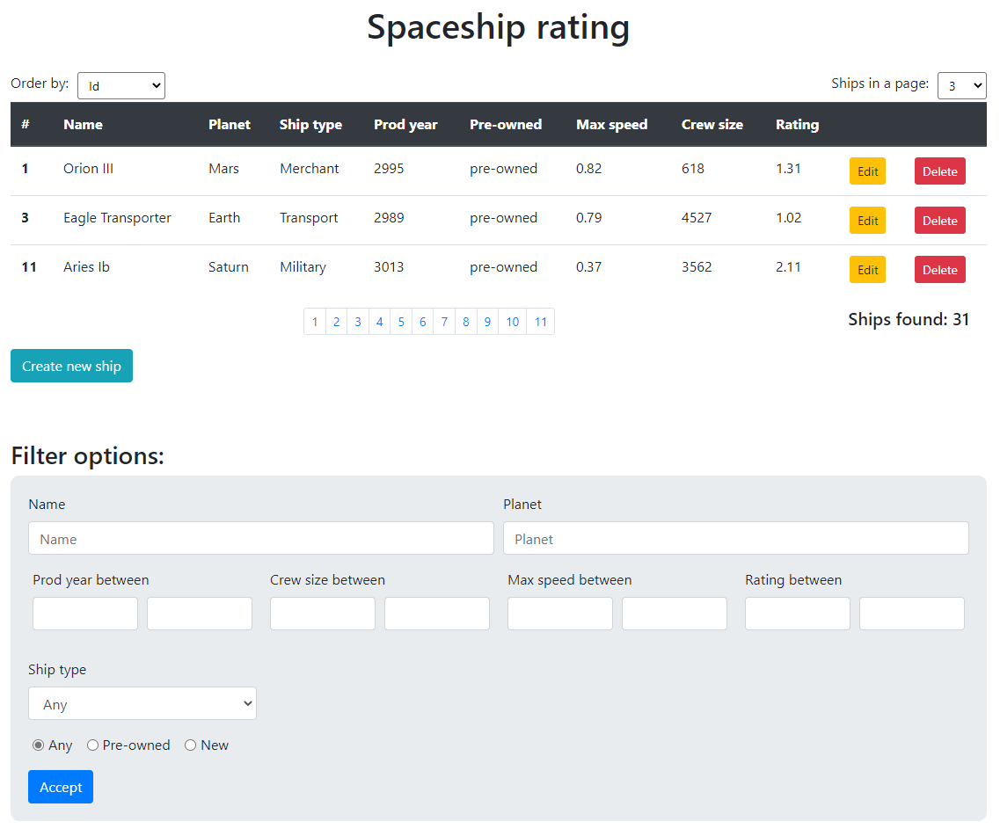

#  Учет космических кораблей
Приложение учета космических кораблей в далеком будущем (в 3019 году). 
Поддерживаются следующие возможности:
1. получать список всех существующих кораблей;
2. создавать новый корабль;
3. редактировать характеристики существующего корабля;
4. удалять корабль;
5. получать корабль по id;
6. получать отфильтрованный список кораблей в соответствии с переданными фильтрами;
7. получать количество кораблей, которые соответствуют фильтрам.

# REST API
## Get ships list
|    |    |
|--- |--- |
| URL | /ships |
| Method | GET |
| URL Params | Optional:   name=String  planet=String  shipType=ShipType  after=Long  before=Long isUsed=Boolean minSpeed=Double maxSpeed=Double minCrewSize=Integer maxCrewSize=Integer minRating=Double maxRating=Double order=ShipOrder pageNumber=Integer pageSize=Integer |
| Data Params | None |
| Success Response | Code: 200 OK Content: [ { “id”:[Long], “name”:[String], “planet”:[String], “shipType”:[ShipType], “prodDate”:[Long], “isUsed”:[Boolean], “speed”:[Double], “crewSize”:[Integer], “rating”:[Double] }, … ] |
| Notes | Поиск по полям name и planet происходить по частичному соответствию. Например, если в БД есть корабль с именем «Левиафан», а параметр name задан как «иа» - такой корабль должен отображаться в результатах (Левиафан). pageNumber – параметр, который отвечает за номер отображаемой страницы при использовании пейджинга. Нумерация начинается с нуля pageSize – параметр, который отвечает за количество результатов на одной странице при пейджинге |

## Get ships count
|    |    |
|--- |--- |
| URL | /ships/count |
| Method | GET |
| URL Params | Optional: name=String planet=String shipType=ShipType after=Long before=Long isUsed=Boolean minSpeed=Double maxSpeed=Double minCrewSize=Integer maxCrewSize=Integer minRating=Double maxRating=Double |
| Data Params | None |
| Success Response | Code: 200 OK Content: Integer |
| Notes |  |

## Create ship
|    |    |
|--- |--- |
| URL | /ships |
| Method | POST |
| URL Params | None |
| Data Params | { “name”:[String], “planet”:[String], “shipType”:[ShipType], “prodDate”:[Long], “isUsed”:[Boolean], --optional, default=false “speed”:[Double], “crewSize”:[Integer] } |
| Success Response | Code: 200 OK Content: { “id”:[Long], “name”:[String], “planet”:[String], “shipType”:[ShipType], “prodDate”:[Long], “isUsed”:[Boolean], “speed”:[Double], “crewSize”:[Integer], “rating”:[Double] } |
| Notes | Мы не можем создать корабль, если: - указаны не все параметры из Data Params (кроме isUsed); - длина значения параметра “name” или “planet” превышает размер соответствующего поля в БД (50 символов); - значение параметра “name” или “planet” пустая строка; - скорость или размер команды находятся вне заданных пределов; - “prodDate”:[Long] < 0; - год производства находятся вне заданных пределов. В случае всего вышеперечисленного ответ с ошибкой и кодом 400. |

## Get ship
|    |    |
|--- |--- |
| URL | /ships/{id} |
| Method | GET |
| URL Params | id |
| Data Params | None |
| Success Response | Code: 200 OK Content: { “id”:[Long], “name”:[String], “planet”:[String], “shipType”:[ShipType], “prodDate”:[Long], “isUsed”:[Boolean], “speed”:[Double], “crewSize”:[Integer], “rating”:[Double] } |
| Notes | Если корабль не найден в БД, ответ с ошибкой и кодом 404. Если значение id не валидное, ответ с ошибкой и кодом 400. |

## Update ship
|    |    |
|--- |--- |
| URL | /ships/{id} |
| Method | POST |
| URL Params | id |
| Data Params | { “name”:[String], --optional “planet”:[String], --optional “shipType”:[ShipType], --optional “prodDate”:[Long], --optional “isUsed”:[Boolean], --optional “speed”:[Double], --optional “crewSize”:[Integer] --optional } |
| Success Response | Code: 200 OK Content: { “id”:[Long], “name”:[String], “planet”:[String], “shipType”:[ShipType], “prodDate”:[Long], “isUsed”:[Boolean], “speed”:[Double], “crewSize”:[Integer], “rating”:[Double] } |
| Notes | Обновляются только те поля, которые не null. Если корабль не найден в БД, ответ с ошибкой и кодом  404. Если значение id не валидное, ответ с ошибкой и кодом  400. |

## Delete ship
|    |    |
|--- |--- |
| URL | /ships/{id} |
| Method | DELETE |
| URL Params | id |
| Data Params | None |
| Success Response | Code: 200 OK |
| Notes | Если корабль не найден в БД, ответ с ошибкой и кодом  404. Если значение id не валидное, ответ с ошибкой и кодом  400. |
